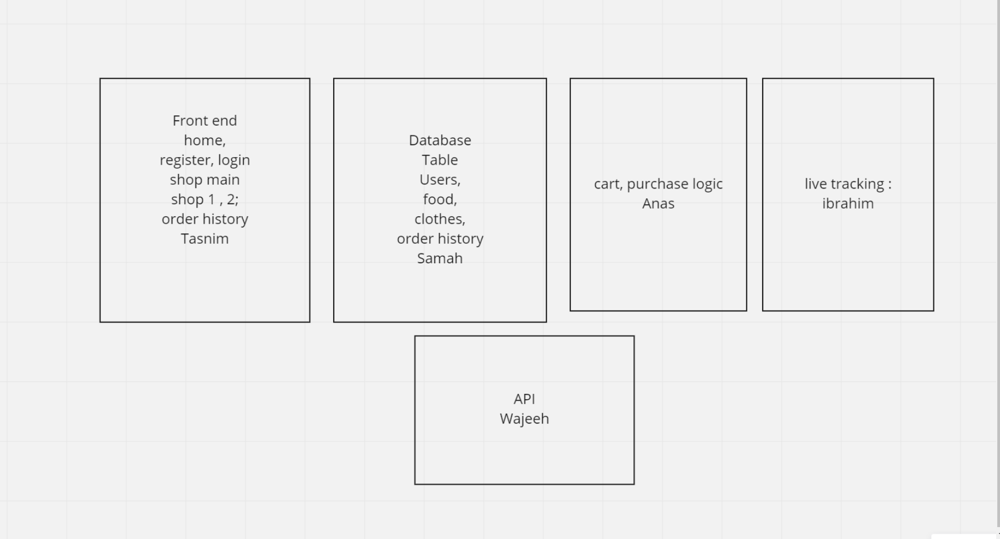

# Participants

- Ibraheem Hammoudeh
- Wajeeh Hussein
- Anas Abu-Abaid
- Samah Alsatary
- Tasneem Maqableh

# Planning

Meeting everyday at 11

# Cooparation plan

# Conflict plan

- What will be your group’s process to resolve conflict, when it arises?

`Voting`

- What will your team do if one person is taking over the project and not letting the other members contribute?

`Contact the instructor to resolve the issue`

- How will you approach each other and the challenges of the project knowing that it is impossible for all members to be at the exact same place in understanding and skill level ?

`Giving each other needed recourses and explination to make sure everyone understand their own tasks`

- How will you raise concerns to members who are not adequately contributing?

`We will meet and tell him about it`

- How and when will you escalate the conflict if your resolution attempts are unsuccessful?

`Contact the instructor`

# Communication plan

- What hours will you be available to communicate?

`Sun-Thu 9-5`

- What platforms will you use to communicate (ie. Slack, phone …)?
  `Discord, Whatsapp`

- How often will you take breaks?
  `Personal prefrence, up to 1.5 hours`

# Work plan

- How you will identify tasks, assign tasks, know when they are complete, and manage work in general?

`Check everyone's strength and weaknesses and assign the tasks after`

- What project management tool will be used?

  `Miro, DBeaver`

# Presentation Deck

[Link](google.com)

# Git Process

- How many people must review a PR?
  `All the team`

- Who merges PRs?
  `All the team`

  How often will you merge?

  `Everyday at the morning`
